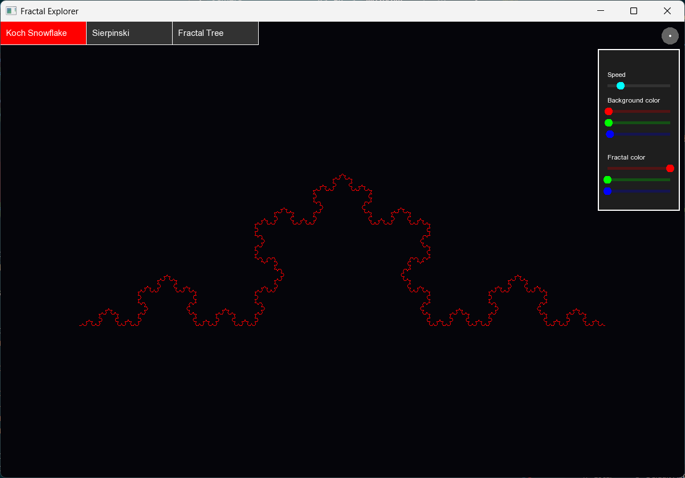
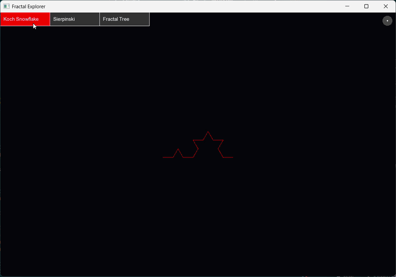
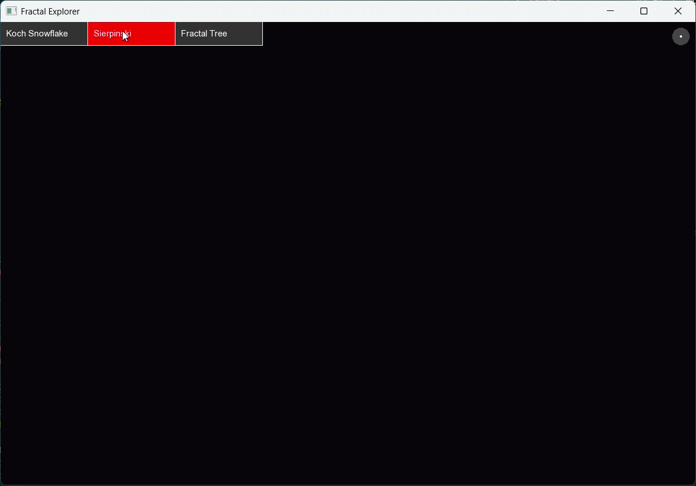

# Fractal Explorer

Interactive C++ fractal explorer built with SFML

## Description

This project renders procedural fractals using SFML and provides a small UI for selecting fractal type, adjusting draw speed, changing colors

## Authors
- Mariia Nyzhnyk
- Veronika Shevchuk

## Features

- Koch snowflake fractal
- Sierpinski triangle fractal
- Fractal tree
- Color sliders for fractal color and background
- Speed control
- Camera view
- Simple tabbed UI and settings panel


### Screenshots
1. **Settings panel**


### Videos 
| Koch Snowflake | Sierpinski Triangle |
| :---: | :---: |
|  |  |
| Fractal tree | Color change |
| :---: | :---: |
|  |  |

### Documentation
- [Fraktale.pdf](documentation/Fraktale.pdf) – provides an accessible overview of fractal definitions and real-world examples, serving as a theoretical complement to the simulation

## Requirements

- C++ compiler with C++17 support
- CMake
- SFML 3.x

## Build

```powershell
cd Build
cmake ..
cmake --build .
```

## Run

```powershell
cd Build
./FractalApp.exe
```

## Project structure

- `CMakeLists.txt` - build configuration
- `main.cpp` - application entry point and UI loop
- `Fractals.cpp` / `Fractals.h` - fractal generation algorithms
- `Settings.h` - application settings and default values
- `SettingsPanel.cpp` / `SettingsPanel.h` - settings panel UI logic
- `Tab.cpp` / `Tab.h` - tab controls for fractal type selection
- `fonts/` - font resources used by the UI
