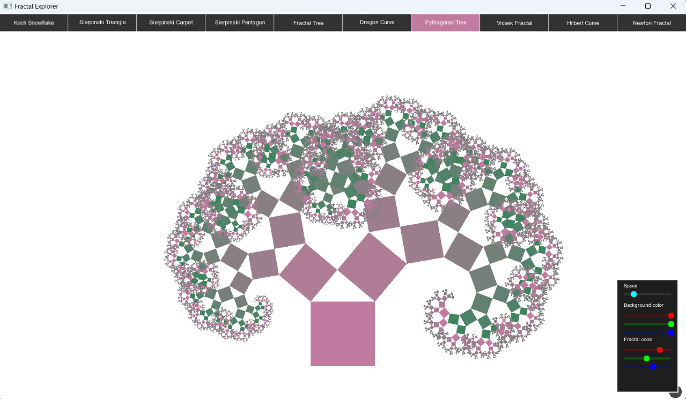
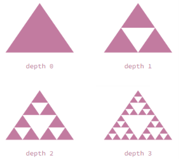
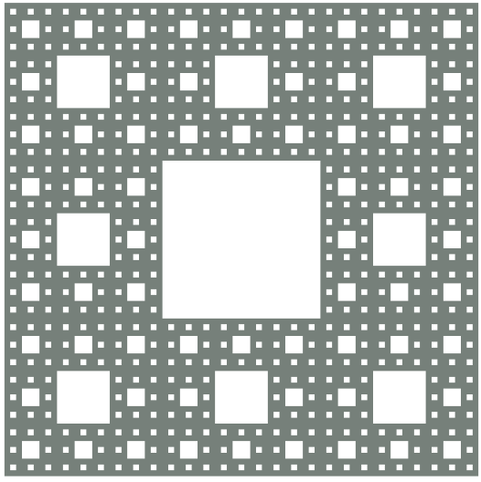
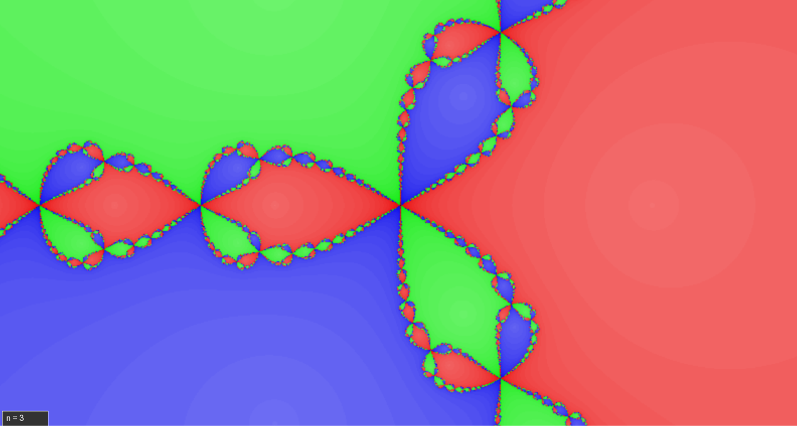
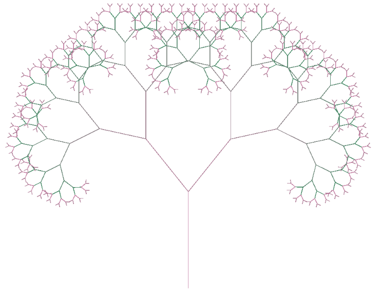
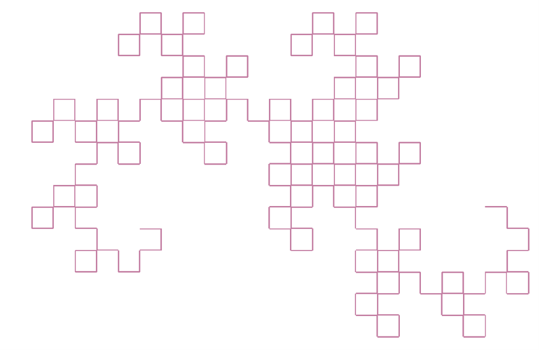
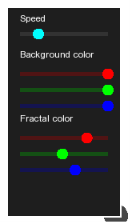

# Fractal Explorer

Interactive C++ fractal explorer built with SFML

## Description

This project renders procedural fractals using SFML and provides a small UI for selecting fractal type, adjusting draw speed, changing colors

## Authors
- Mariia Nyzhnyk (code)
- Veronika Shevchuk (text)

## Features

- Koch snowflake fractal
- Animated Koch construction from one bold horizontal segment through successive triangle replacements
- Sierpinski triangle fractal
- Sierpinski carpet and pentagon fractals
- Sierpinski animation with filled triangles and an unfilled central triangle
- Fractal tree starting from a bold vertical trunk
- Dragon, Vicsek fractal, and Hilbert curve
- Pythagoras tree with adjustable angle and depth
- Newton fractal for z^n - 1 = 0 with root-based coloring
- Five shades derived from the base fractal color
- Color sliders for fractal color and background
- Speed control
- Ten construction stages for each procedural fractal
- Camera view
- Simple tabbed UI and settings panel

### Newton fractal controls

- Select the **Newton Fractal** tab to view basins of attraction for z^n - 1 = 0.
- Each pixel color shows which root Newton's method converges to and how many iterations it took.
- Click the `n = ...` button in the bottom-left corner to cycle n through **3, 4, 5, and 6**.
- The settings panel is hidden in Newton mode.

### Animation controls

- Press `Space` to pause or resume the current fractal construction.
- Koch, Sierpinski, and Tree are built progressively, one subdivision or branch level at a time.
- While construction is paused, press `Left` or `Right` to move one level backward or forward.
- While construction is running, the `Speed` setting controls the delay between levels.
- In Pythagoras Tree mode, `Up`/`Down` change the angle and `Left`/`Right` change the depth.
- New fractals use the same animated level construction; `Left` and `Right` change their level while paused.

## Screenshots

Capture these at **1600×900** after building, then save them under `documentation/`.



| Sierpinski Triangle | Sierpinski Carpet | Newton (n=3) |
| :---: | :---: | :---: |
|  |  |  |

| Fractal Tree | Dragon Curve | Color from base |
| :---: | :---: | :---: |
|  |  |  |

**Recommended captures**

| File | What to capture |
| :--- | :--- |
| `hero_overview.png` | Full window with tabs, mid-stage fractal, settings gear visible |
| `settings_panel.png` | Settings panel open with sliders |
| `sierpinski_triangle_steps.png` | Sierpinski Triangle paused around stage 6 (multi-color steps) |
| `sierpinski_carpet.png` | Sierpinski Carpet at full stage |
| `newton_n3.png` | Newton fractal at n=3 with toggle button visible |
| `newton_n6.png` | Newton at n=6 (optional second Newton shot) |
| `color_palette.png` | Same fractal with two different base colors |
| `fractal_tree.png` | Fractal Tree at full stage |
| `dragon_curve.png` | Dragon Curve around stage 8 |

**Tips:** Press `Space` to pause before PNG screenshots. Use GIFs only for animations (`koch_animation.gif`, `newton_toggle.gif`).

### Videos
| Koch Snowflake | Sierpinski Triangle |
| :---: | :---: |
|  |  |
| Fractal tree | Color change |
|  |  |

### Documentation
- [Fraktale.pdf](documentation/Fraktale.pdf) – provides an accessible overview of fractal definitions and real-world examples, serving as a theoretical complement to the simulation

## Requirements

- C++ compiler with C++17 support
- CMake
- SFML 3.x

## Build

```powershell
cd Build
cmake ..
cmake --build .
```

## Run

```powershell
cd Build
./FractalApp.exe
```

## Project structure

- `CMakeLists.txt` - build configuration
- `main.cpp` - application entry point and UI loop
- `Fractals.cpp` / `Fractals.h` - fractal generation algorithms
- `NewtonExplorer.cpp` / `NewtonExplorer.h` - Newton fractal renderer and n toggle
- `Settings.h` - application settings and default values
- `SettingsPanel.cpp` / `SettingsPanel.h` - settings panel UI logic
- `Tab.cpp` / `Tab.h` - tab controls for fractal type selection
- `fonts/` - font resources used by the UI
