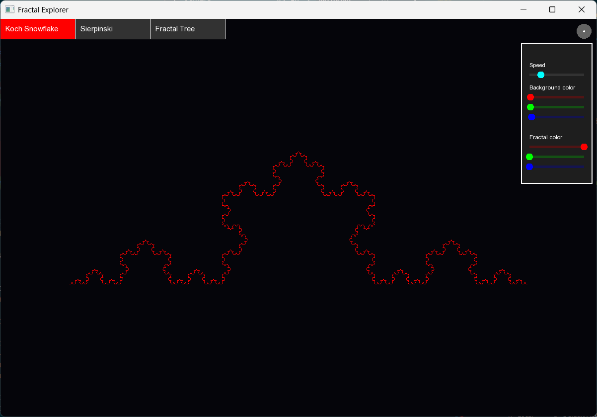
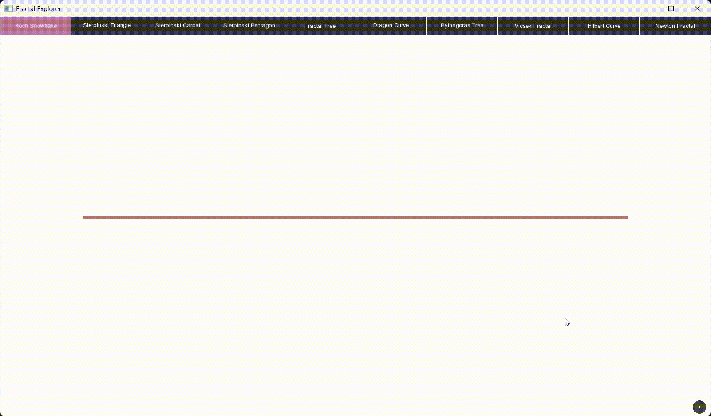
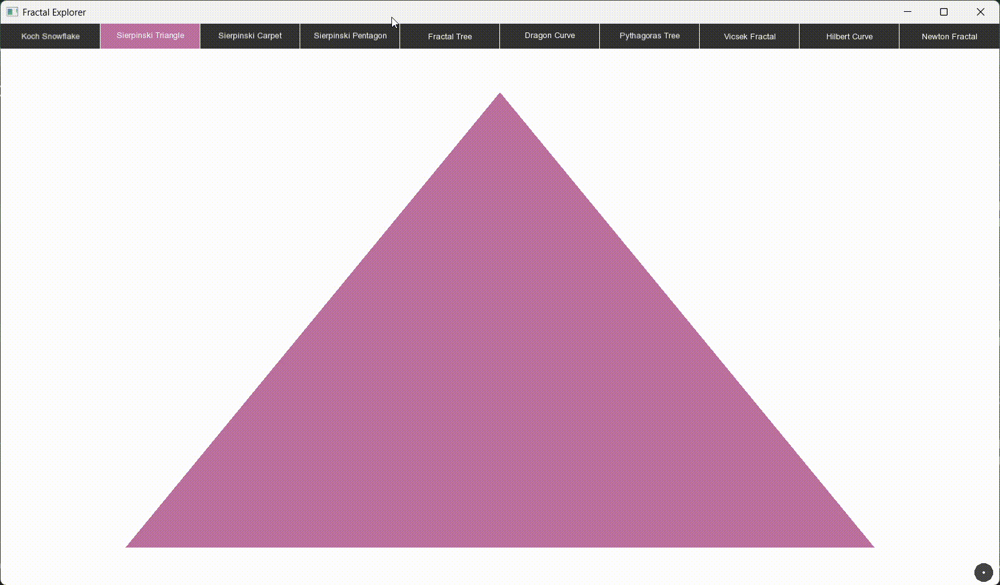
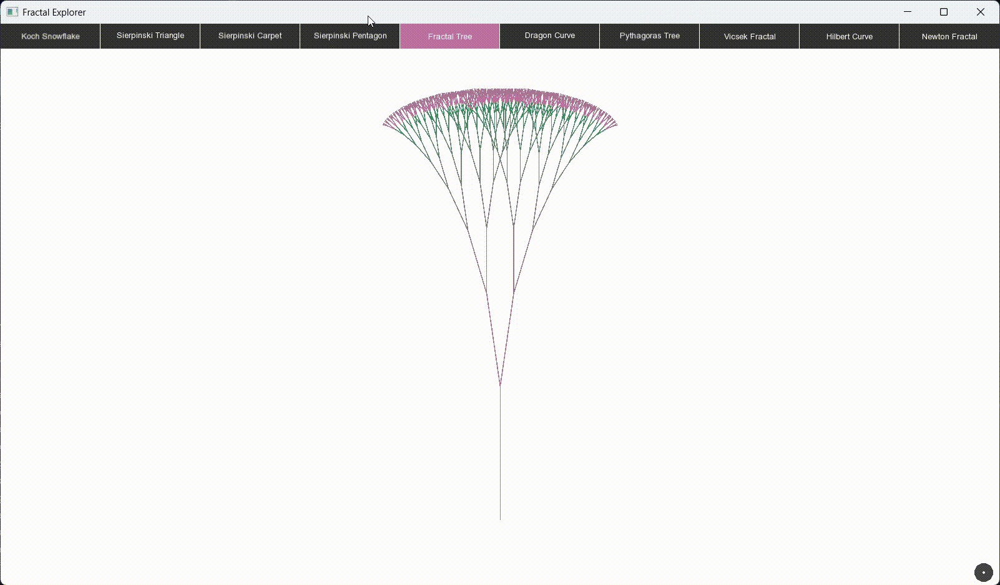

# Fractal Explorer

Interactive C++ fractal explorer built with SFML

## Description

This project renders procedural fractals using SFML and provides a small UI for selecting fractal type, adjusting draw speed, changing colors

## Authors
- Mariia Nyzhnyk
- Veronika Shevchuk

## Features

- Koch snowflake fractal
- Animated Koch construction from one bold horizontal segment through successive triangle replacements
- Sierpinski triangle fractal
- Fractal tree starting from a bold vertical trunk
- Mandelbrot set explorer with smooth pixel coloring
- Color sliders for fractal color and background
- Speed control
- Ten construction stages for each procedural fractal
- Camera view
- Simple tabbed UI and settings panel

### Mandelbrot controls

- Left-click to zoom in at the cursor position.
- Right-click to zoom out at the cursor position.
- Zooming also starts a small smooth rotation.
- Hold the left mouse button and move to drag the Mandelbrot fractal with the cursor.
- Right-click to zoom out at the cursor position.
- Press `Up` or `Down` to zoom and rotate; press `Left` or `Right` to rotate more strongly.
- Select the `Mandelbrot` tab to open it immediately; it uses a fixed performance-friendly render size.

### Animation controls

- Press `Space` to pause or resume the current fractal construction or Mandelbrot rotation.
- Koch, Sierpinski, and Tree are built progressively, one subdivision or branch level at a time.
- While construction is paused, press `Left` or `Right` to move one level backward or forward.
- While construction is running, the `Speed` setting controls the delay between levels.


### Screenshots
1. **Settings panel**


### Videos 
| Koch Snowflake | Sierpinski Triangle |
| :---: | :---: |
|  |  |
| Fractal tree | Color change |s
|  |  |

### Documentation
- [Fraktale.pdf](documentation/Fraktale.pdf) – provides an accessible overview of fractal definitions and real-world examples, serving as a theoretical complement to the simulation

## Requirements

- C++ compiler with C++17 support
- CMake
- SFML 3.x

## Build

```powershell
cd Build
cmake ..
cmake --build .
```

## Run

```powershell
cd Build
./FractalApp.exe
```

## Project structure

- `CMakeLists.txt` - build configuration
- `main.cpp` - application entry point and UI loop
- `Fractals.cpp` / `Fractals.h` - fractal generation algorithms
- `Mandelbrot.cpp` / `Mandelbrot.h` - image-based Mandelbrot renderer and controls
- `Settings.h` - application settings and default values
- `SettingsPanel.cpp` / `SettingsPanel.h` - settings panel UI logic
- `Tab.cpp` / `Tab.h` - tab controls for fractal type selection
- `fonts/` - font resources used by the UI
